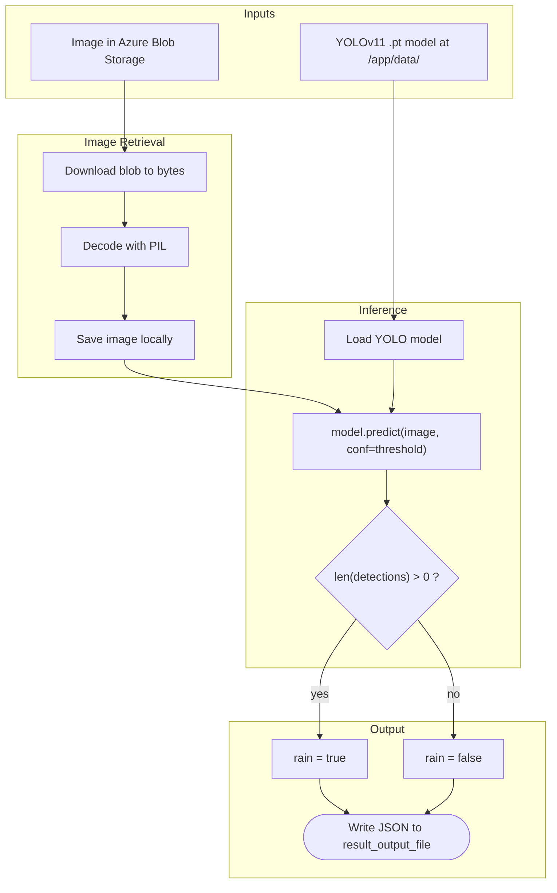

# SARA Rain Drop Detector

The **SARA Rain Drop Detector** provides an automated process to determine whether rain drops are present in an image, using a trained YOLOv11 detection model.

Given a single image stored in Azure Blob Storage, the analyzer runs YOLO inference and writes a JSON result containing `rain` (bool) — `true` if at least one detection above the configured confidence threshold is produced, otherwise `false`.

## Dependencies

The dependencies used for this package are listed in `pyproject.toml` and pinned in `uv.lock`. This ensures our builds are predictable and deterministic. This project uses [uv](https://docs.astral.sh/uv/) for dependency management:

```bash
uv lock
```

To update the dependencies to the latest versions, run:

```bash
uv lock --upgrade
```

`torch` and `torchvision` are pinned to the CPU-only PyTorch index (configured under `[tool.uv.sources]`) to keep the runtime image small.

### Setup

For inference to run, a YOLOv11 `.pt` model file must be available on disk. In production the model is mounted as a volume by the infrastructure at `/app/data/`. The path is configurable via the `MODEL_PATH` environment variable (default: `/app/data/rain_detection_model.pt`).

The analyzer also needs read access to the source Azure Storage account that holds the image. Provide its connection string via `SOURCE_STORAGE_CONNECTION_STRING`.

### Install locally

Install with `uv sync --extra dev`.

### Run tests

Run tests with `uv run pytest .`

### Example `.env.example`

```bash
SOURCE_STORAGE_CONNECTION_STRING=DefaultEndpointsProtocol=ht ...
DESTINATION_STORAGE_CONNECTION_STRING=DefaultEndpointsProtocol=ht ...
MODEL_PATH=/app/data/rain_detection_model.pt
DETECTION_CONFIDENCE_THRESHOLD=0.25
OTEL_SERVICE_NAME=sara-rain-drop-detector
OTEL_EXPORTER_OTLP_ENDPOINT=http://localhost:4317
OTEL_EXPORTER_OTLP_PROTOCOL=grpc
```

## Run

The CLI exposes a single command that takes a JSON array of blob locations (must contain exactly one entry — this is a single-image analyzer) and writes the result to `result_output_file`:

```bash
python main.py \
    --input-blob-storage-locations '[{"blobContainer":"my-container","blobName":"path/to/image.png"}]' \
    --result-output-file /tmp/result.json
```

The output file contains:

```json
{ "rain": true }
```

## Docker

Build the image:

```bash
docker build -t sara-rain-drop-detector .
```

Run with the model mounted from the host and the source storage connection string injected:

```bash
docker run --rm \
    -v /path/to/model_dir:/app/data:ro \
    -e SOURCE_STORAGE_CONNECTION_STRING="DefaultEndpointsProtocol=..." \
    -e MODEL_PATH=/app/data/rain_detection_model.pt \
    sara-rain-drop-detector \
    --input-blob-storage-locations '[{"blobContainer":"my-container","blobName":"path/to/image.png"}]' \
    --result-output-file /tmp/result.json
```

## Pipeline Diagram



## License

This project is licensed under the **GNU Affero General Public License v3.0 or later** (AGPL-3.0-or-later) — see [LICENSE](LICENSE). The AGPL is required because the project depends on [Ultralytics](https://github.com/ultralytics/ultralytics), which is itself AGPL-3.0 licensed.
